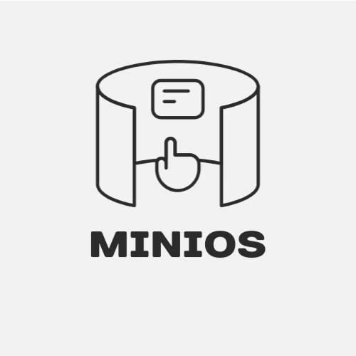
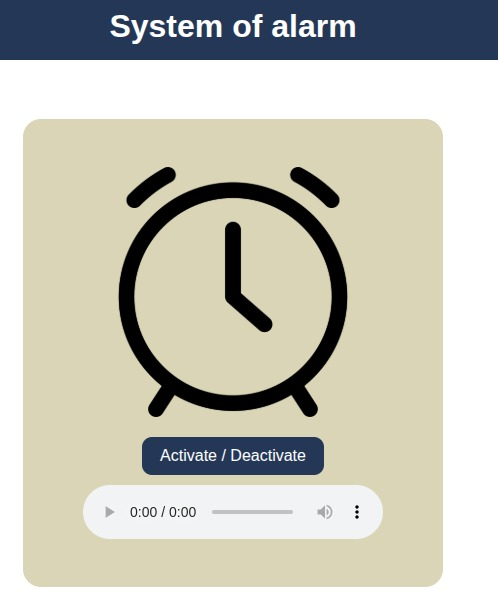
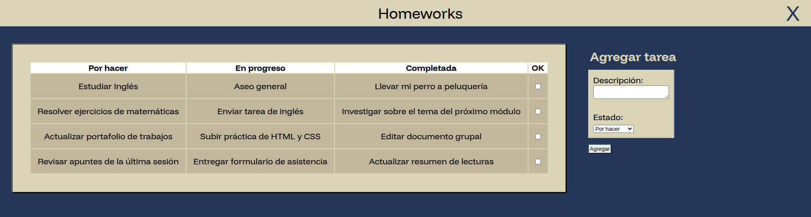
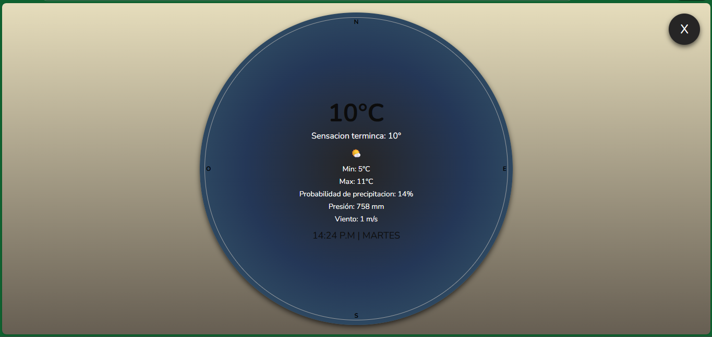
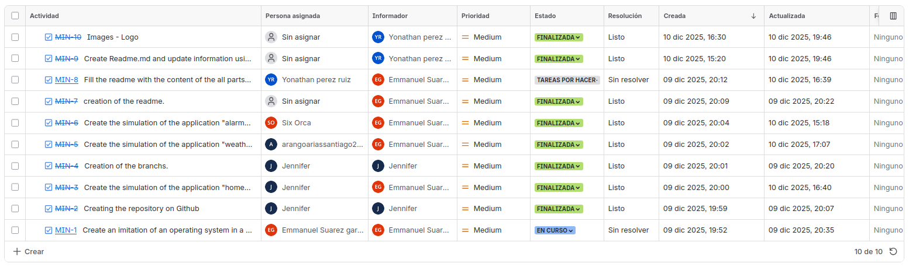

# Indice
* [Titulo e imagen de portada](#logo)
* [Descripción del proyecto](#minios-systems)
* [Tecnologias Utilizadas](#tecnologies)
* [Estado del proyecto](#state)
* [Acceso al proyecto](#run-runner-rocket)
* [Pantallazos](#screenshots-camera)
* [Contribuyentes](#authors)


## Logo


## MiniOS Systems

This project is an iframe simulation that allows you to view information on the web without having to refresh the page.

This ensures that information is displayed and not lost when the page is refreshed.


## Tecnologies

* Html 5
  * Iframes
* Css 
  * Flexbox and Grip

## State
:construction: :hammer: Proyecto en construcción :hammer: :construction:


## Run :runner: :rocket: 

Clone the project 

```bash
  git clone https://link-to-project
```

Go to the project directory

```bash
  cd my-project
```
```bash
  code .
```
Or you can execute 

```bash
  index.html
```


## Screenshots :camera: 

### Index 
This module is the main part of the problem where the entire project will be executed.

#### Alarm :alarm_clock: :alarm_clock: :alarm_clock:

This module activates the alarm by generating a sound while moving from side to side.


### :notebook:  Notes :notebook: 
Notepad allows you to quickly write down any information you need.


####  :calendar: Homeworks :calendar:
This module displays a list with a checkbox which allows us to select completed tasks.


### Weather :sunny: :umbrella: :cloud:
This module displays a circle and continuously changes colors, alluding to the temperature, with a timer.


### Jira work spaces
The work area allowed us to generate activities or epics; the epics were each of the work modules (Index, notes, climate, and alarm), which were to achieve a larger objective.

* Epicas
  * Index
  * Notes
  * Climate
  * Alarm 



## Resource

1. Gift or icons:  https://gist.github.com/rxaviers/7360908
2. WorkSpace Jira: https://www.atlassian.com/es/software/jira
3. Github : https://github.com/Celula7-MiniOs/MiniOs
4. Flat-icon : https://www.flaticon.es/
5. google fonts : https://fonts.google.com/
6. Color palette : https://paletadecolores.com.mx/


## Authors 

Contributions are always welcome!

:woman: Jenifer Lopez\
:man: Juan Pablo Olarte\
:man: Emanual Suarez Garcia\
:man: Santiago Arango\
:man: Yonathan Perez Ruiz

